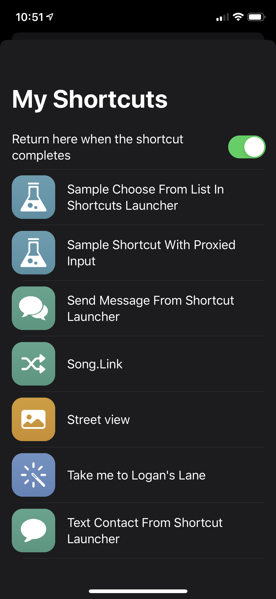
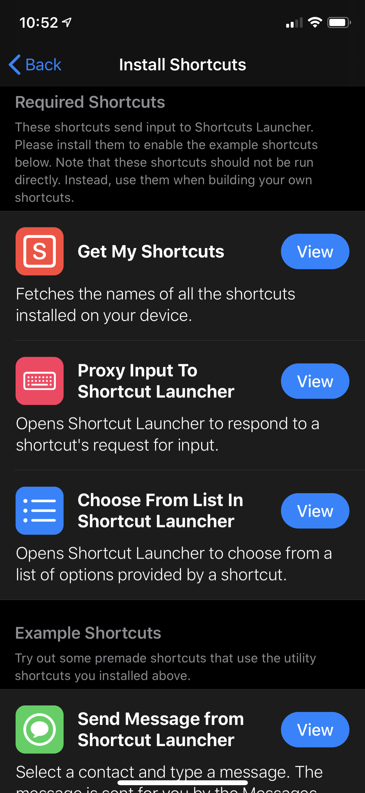
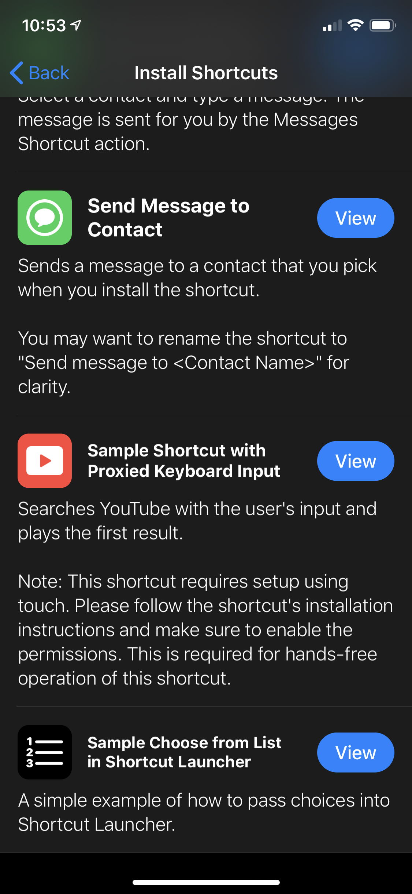
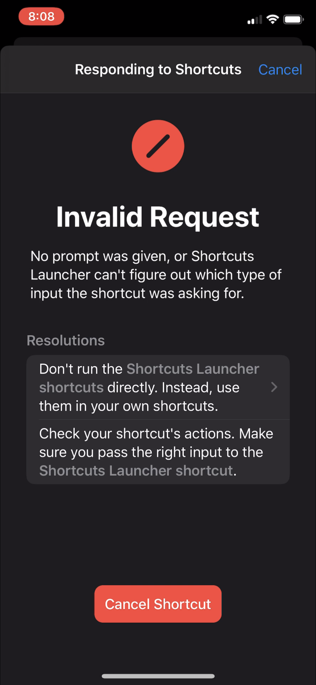

# shortcut-launcher

A test project that proxies user input outside of the Shortcuts app, adding potential for multi-modal user input. Inspired by and uses a head tracking implementation from [Vocable AAC](https://github.com/willowtreeapps/vocable-ios)'s multi-modal user interface.

# Features

### Import the user's shortcuts

### Proxy input away from Shortcuts
	- Bundles proxying loginc and enables app-side or Shortcut-side error handling into a premade shortcut that's easy to run from other shortcuts
	- Includes sample shortcuts using the bundled shortcuts

	
	

### Proxied error recovery
	- Allows the user to recover from a shortcut error in the proxied app. This is particularly useful when using the app in a hands-free configuration.
